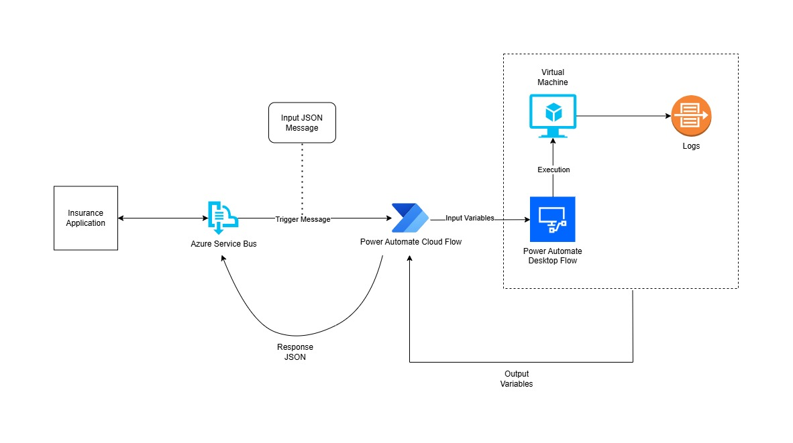

# Policy Automation Using Power Platform & Azure Service Bus

## Project Overview

This project automates the policy creation process in an internal **Insurance Application** using **Microsoft Power Platform**, **Azure Service Bus (ASB)**, and **Unattended Robotic Process Automation (RPA)** flows.

The solution enables seamless integration between the **Policy Source System** and the **Insurance Application**, automating the entire process of policy data ingestion and entry into the target system.

I developed this solution as the **sole developer** — covering everything development to testing, deployment, and post-production support with the guidance of a Solution Architect.

---

## Solution Architecture

1. The **Policy Source System** sends policy data as messages to an **Azure Service Bus Queue**.
2. A **Power Automate Cloud Flow** is automatically triggered upon message arrival in the queue.
3. The **Cloud Flow**:
   - Parses the incoming message (JSON).
   - Maps and assigns required variables.
   - Triggers an **Unattended Desktop Flow** on a Virtual Machine (VM).
   - Creates Logs of the execution on SharePoint as well.
4. The **Desktop Flow**:
   - Logs into the **Insurance Application**.
   - Automates the complete policy entry process.
   - Performs error handling and captures screenshots if issues occur.
5. Execution status and logs are recorded for traceability on the execution machine.

---

## Key Features

- **Azure Service Bus Queue Integration**  
- **Unattended Desktop RPA Automation**  
- **Robust Error Handling with Screenshot Logging**  
- **Modular Sub-Flows for Reusability**  
- **Configuration-Driven Approach** (for app paths, environment-specific data, etc.)  
- **Multi-Environment Support (DEV, TEST, PROD)**  
- **Comprehensive Logging & Reporting**  

---

## Technical Highlights

| Technology               | Details                                       |
|--------------------------|-----------------------------------------------|
| Power Automate Cloud Flow| Triggers RPA based on incoming ASB messages    |
| Power Automate Desktop   | Automates policy creation on Insurance System  |
| Azure Service Bus        | Queue-based message processing                |
| Microsoft Power Platform | Flow Management, Monitoring & Execution       |
| Insurance Application    | Target System for Policy Entry Automation     |

---
## Overall Solution Design

## Power Automate Flow Design

### Cloud Flow
- Triggered automatically when a message arrives in the ASB queue.
- Parses and maps the incoming JSON payload.
- Invokes the Unattended Desktop Flow with parsed data.

### Desktop Flow
- Reads configuration details for environment-specific settings.
- Executes steps to:
  - Log in
  - Navigate the Insurance Application
  - Enter policy data
  - Verify successful submission
  - Handle errors gracefully

#### Sub-Flows:
- **Service Termination**
- **FolderStructure**
- **ReadFromConfig**
- **Login Automation**
- **Client Redundancy Check**
- **Account Creation**
- **Policy Creation**
- **Invoice Generation**
- **Transactions**

#### Sample JSON Input:
{
    "policyNumber": "POLICY-20250701",
    "policyHolderName": "John Smith",
    "policyHolderAddress": "456 Elm Street, Springfield",
    "country": "US",
    "postalCode": "62704",
    "policyType": "Auto Insurance",
    "coverageStartDate": "2025-07-01",
    "coverageEndDate": "2026-06-30",
    "insuredAmount": 150000,
    "premiumAmount": 1200.50,
    "policyStatus": "Active",
    "agentId": "AGT-98765",
    "agentName": "Sarah Johnson",
    "commissionPercentage": 10,
    "transactionType": "New Business",
    "transactionDate": "2025-07-08",
    "paymentMethod": "Credit Card",
    "taxType": "Sales Tax",
    "taxPercentage": 8.25
}

#### Sample JSON Output: 
{
    "policyNumber": "POLICY-20250701",
    "processingStatus": "Success",
    "message": "Policy created successfully in the Insurance Application.",
    "transactionId": "TXN-123456789"
}

These flows comprise **Error Handling (with Screenshot Capture)** to deal with any failures.

All sub-flows are modular for reuse and ease of maintenance.

---
## License
This repository is for personal portfolio demonstration purposes only. No confidential or proprietary information is included.

---

## Author
Sarthak Sharma  
*Low-Code Developer | AI Automation/Innovation Engineer*
